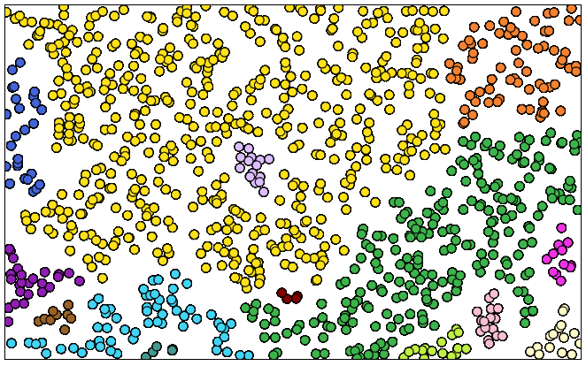

# dbscan-p5

Interactive demo of the [DBSCAN](https://en.wikipedia.org/wiki/DBSCAN) clustering algorithm.
Made with [P5](https://p5js.org/).

[Try it out here!](https://akleemans.github.io/dbscan-p5/)

